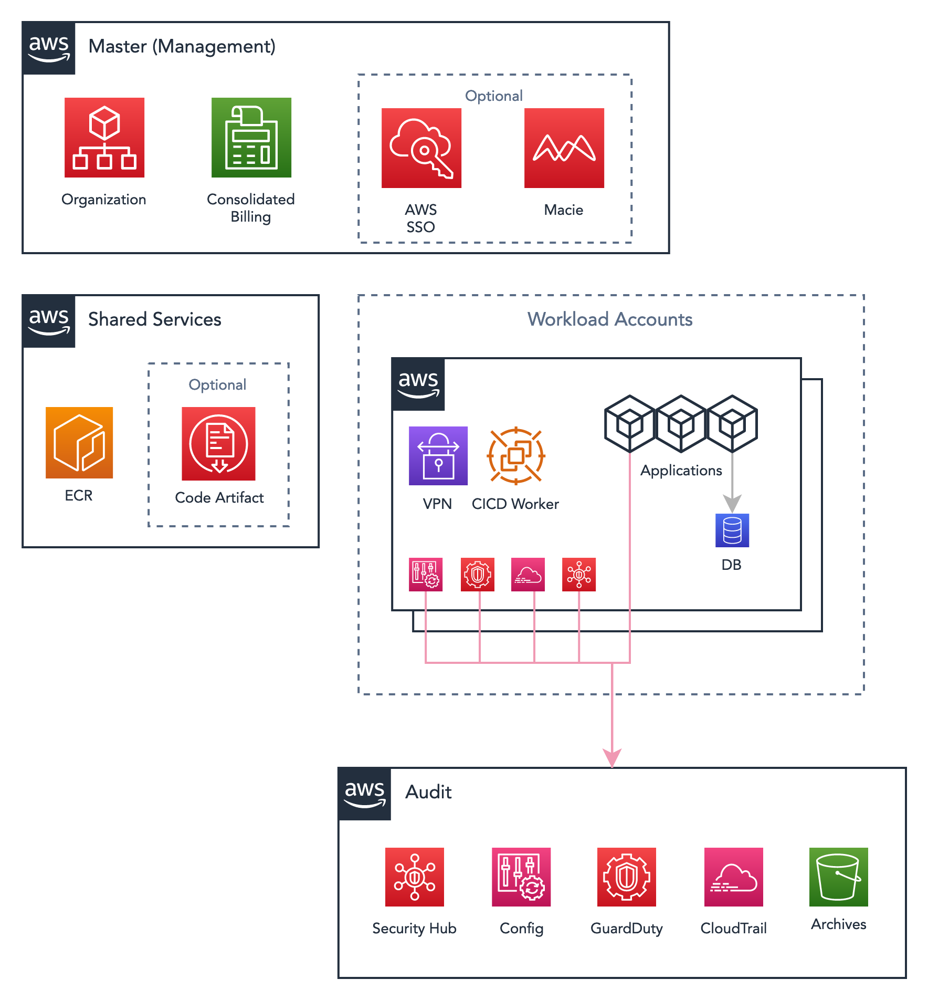

# Accounts

## Account Structure

Following some Well-Architected principles from AWS, the accounts can be classified into the following categories:

| Account Type   | Description   |
| ---------------| ------------- |
| Master         | Sometimes called Management, it's the Root Organization account containing Consolidate Billing and the AWS Organization |
| Audit          | The audit account has read-only access and is responsible for storing logs to be used in a possible internal or external audit. |
| Shared-Services| This account has any shared services to be consumed by the AWS structure like ECR repositories, CI agents, VPN (when centralised) |
| Workload       | Also called "Line of Business", all applications run into these accounts. It can have VPC, clusters, ALBs, RDS databases, SQS, Route53 and other resources that support applications to run. |

## Accounts

This organization has the following accounts:

| Account Name | Account ID | Region | Type |
| -------------| ---------- | ------ | ---- |








| {{ account.account_name }} | {{ account.aws_account_id }} | {{ account.aws_region }} | {{ account_type }} |
