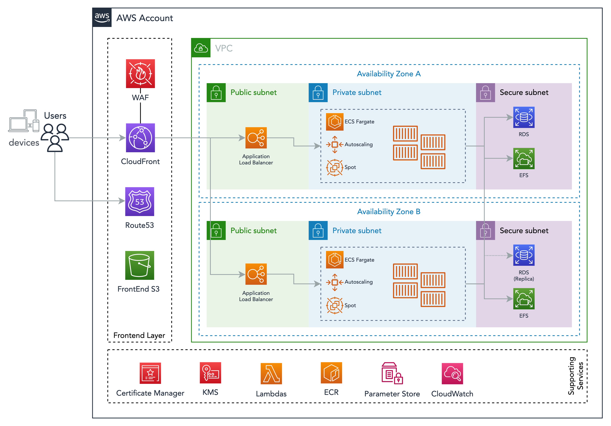

# ECS

ECS stands for Elastic Container Service and is an AWS service that manages containers and has 2 modes: EC2 or Fargate.

The EC2 mode has more flexibility but also higher cost of operation as the EC2s have operational systems that need to be patched and maintained.

With Fargate, Amazon will manage the host underlying the container, making it easier to achieve compliance and maintain the environment.

There are a few concepts behind ECS that are important to know, basically Clusters, Services and Tasks.

For a deeper dive, check the documentation at [https://docs.aws.amazon.com/AmazonECS/latest/developerguide/Welcome.html]().

Clusters are like namespaces, where ECS Services live.

When using EC2, Clusters are where EC2 register themselves (via a script in the Userdata).

ECS Services are similar to Autoscaling groups, it controls the number of tasks that should be running, the autoscaling of those tasks, which Load Balancer it will register to accept external connections and also the task definition that those tasks will use.

Task Definition is a JSON file that sets the environment that your containers will run on. That's where environment variables, docker parameters, docker image and ports are set, among other configurations.

And finally, Tasks are running containers or a set of containers defined by the task definition. Each task produces individual logs and via the ECS service, it should be registered to a Target Group, so it can receive traffic from the ALB.



## Deployments

ECS deployments are done using the helper container [https://github.com/dnxLabs/docker-ecs-deploy](). It runs the script `src/deploy.sh` inside the same repo that handles the deployments.

It uses CodeDeploy to manage the deployment, executing the following steps:

* The ECS Service is updated with a new task-definition, it has the newer image to be deployed (along with other changes in the task-definition).
* Service creates a "task-set" that will run and attach to the "non-live" target group which can be the blue or green depends on which one is live at the moment. Example: If the ECS Service is using the green target group as live, then the new task-set is attached to the blue target group.
* CodeDeploy waits to the tasks to stabilise and the healthcheck to pass.
* Passing the healthcheck, CodeDeploy waits for the "Cutover" signal, also called "Reroute Traffic" in the CodeDeploy UI.
* Cutover will then allow the previously non-live target group (blue) to receive traffic, making it "live" and drain the connections of the current live one (green).
* The drained tasks are now terminated, and the green target group is now marked as being the non-live one.

Instructions on how to run a deployment can be found in the README file inside the `.deploy` folder of the applications.

## Debugging a Task

### Fargate

Using the AWS Console, navigate to ECS, chose the Cluster and find the Task you would like to connect to debug.

Copy the Task ID, the Cluster name and the Container name that you which to connect.

With the above information in hand, open a CloudShell by clicking in the terminal icon in the top-right corner of the AWS Console.

Once it opens, run:

```bash
aws ecs execute-command --cluster <cluster name> \
    --task <task id>  \
    --container <container name> \
    --interactive \
    --command "/bin/sh"
```

You will be connected to the container similar to an SSH session.

### EC2

Using the AWS Console, navigate to ECS, chose the Cluster and find the Task you would like to connect to debug.

Under "Container Instance", click in the instance ID to be redirected to the EC2 Console.

In the EC2 Console with the Instance selected, choose "Connect" and then select "Session Manager".

Session Manager will give you access to the EC2 instance. Inside the instance you can connect to any running container by typing:

```bash
docker ps
# find container you wish to connect
docker exec -it <container id> /bin/sh
```

