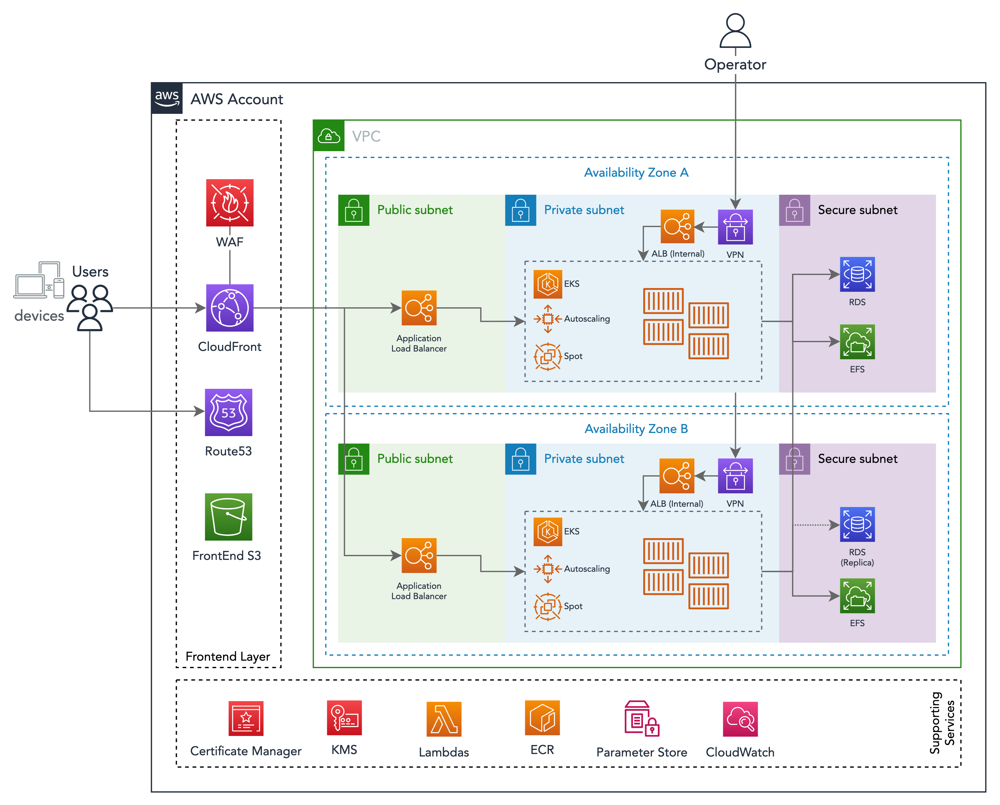

# EKS

EKS is a managed Kubernetes from AWS.

To understand more about EKS, please read: [https://docs.aws.amazon.com/eks/latest/userguide/getting-started.html]().

## Node Groups

The worker nodes are created using Node Groups and are managed by EKS.

You might have one or more Node Groups, usually multiple groups are used to isolate workloads or when workloads have different instance requirements.

As an example you might have one Node Group for normal applications and other to run long-running jobs that cannot run on Spot instances.

Or one for stateless apps and another for stateful services that to not autoscale.

Node Groups are deployed to the Private Subnet as they need internet access to download public docker images.

## Secrets

Kubernetes has its own Secrets [https://kubernetes.io/docs/concepts/configuration/secret/](), but there are controllers that integrate with AWS services like Secrets Manager and SSM Parameters.

The controller **External Secrets** can map external secrets from Secrets Manager and SSM to Kubernetes secrets.

A description on how to use the controller can be found at [https://github.com/DNXLabs/terraform-aws-eks-external-secrets]().

For more information on secrets, check the [Secrets](Architecture.Secrets.md) section of this document.

## Logs

When using the Cloudwatch Logs controller, logs are automatically sent to Cloudwatch Logs.

Always make sure that your apps send logs to the stdout when building the container image.

For more information, check the [Logs](Architecture.Logs.md) section of this document.

## How to Configure Controllers

EKS controllers are deployed using Helm charts enclosed by Terraform.

These controllers can be enabled and configured in the `kubernetes` stack of this foundation.

In the configuration file there will be a list of controllers that can be used, some might be enabled already.