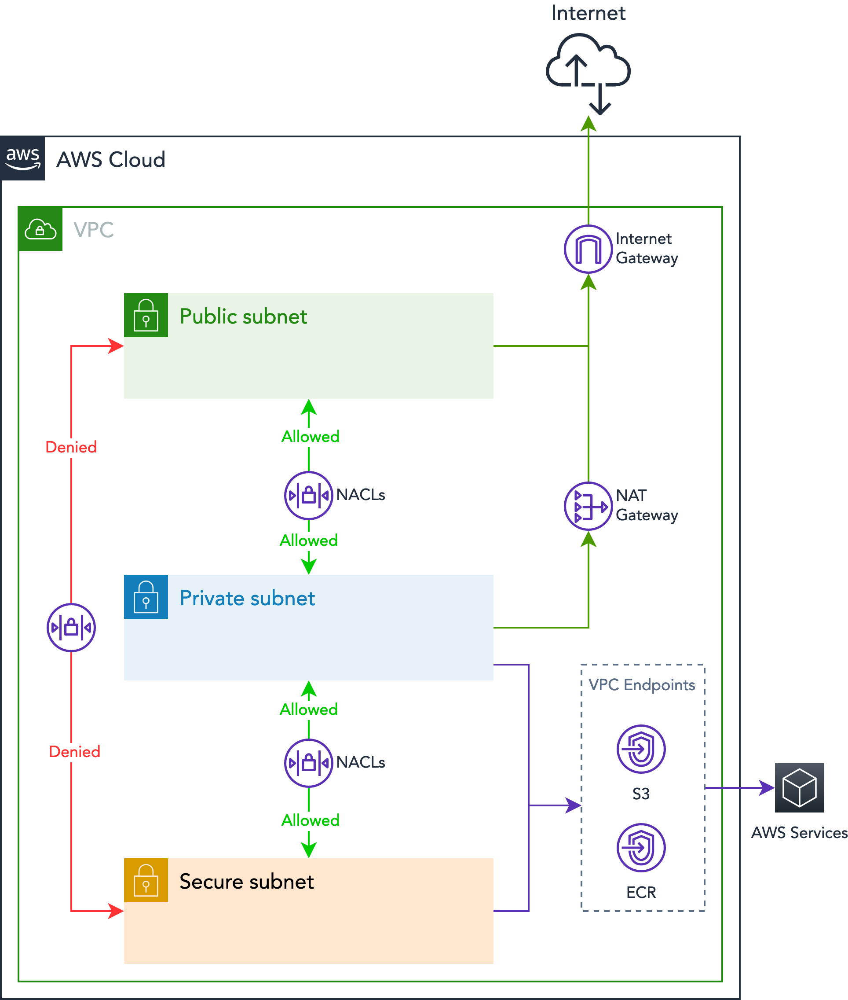

# Networking

## VPC

The stack controlling the network resources is the **Network** stack.

Normally, the workload accounts (prod, nonprod, shared-services) have VPCs deployed so they are able to host apps and DBs.

The list of VPCs per AWS accounts is below:

| AWS Account ID | CIDR | VPC ID | Number of Nats | Number of Subnets per Layer |
| -------------- | ---- | ------ | -------------- | --------------------------- |

| {{ stacks.network.workspaces[workspace_name].aws_account_id }} | {{ workspace.network.cidr_block }} | {{ workspace.network.vpc_id }} | {{ workspace.network.nat_gateway | length }} | {{ workspace.network.private_subnets | length }} |


Some accounts might have 1 NAT Gateway, while others might have 3 or zero.

Accounts with 1 NAT Gateway cannot withstand an Availability Zone (AZ) failure. So it's recommended to have one NAT Gateway per AZ in production accounts.

In high-compliance environments, there might be no NAT Gateways as internet access is restricted to applications. In this case the use of a Proxy like Squid or Tinyproxy is recommended.

## Subnets

Inside every VPC (Virtual Private Cloud) there are subnets to manage network traffic within the VPC leveraging robust security layers for your environments.

| Subnets Layer | Description |
| ------------- | ----------- |
| Public        | This layer has public access, typically all workloads here will have a public endpoint. AWS Load Balancers and AWS NATs (Network Address Translation) will be deployed into this layer. |
| Private       | Private subnets do not have inbound public access, but can access public and secure subnets. All outbound requests are routed to NAT Gateways (Network Address Translation) deployed on the public subnets. Application workloads should be deployed into this layer. |
| Secure        | Secure subnets do not have public access, they are only accessible from Private subnets and are ideal for data storage services. |

### List of subnets per account



#### Account {{ stacks.network.workspaces[workspace_name].account_name }} ({{ stacks.network.workspaces[workspace_name].aws_account_id }})

| Subnet Name | Scheme (Layer) | CIDR            | ID | Availabillity Zone |
| ----------- | -------------- | --------------- | -- | ------------------ |

| {{ subnet.tags.Name }} | {{ subnet.tags.Scheme }} |{{ subnet.cidr_block }} | {{ subnet.id }} | {{ subnet.availability_zone }} |


| {{ subnet.tags.Name }} | {{ subnet.tags.Scheme }} |{{ subnet.cidr_block }} | {{ subnet.id }} | {{ subnet.availability_zone }} |


| {{ subnet.tags.Name }} | {{ subnet.tags.Scheme }} |{{ subnet.cidr_block }} | {{ subnet.id }} | {{ subnet.availability_zone }} |



## VPC Peering

When needed, VPC peering is set between VPCs of different accounts.

The list of peering connections per account are shown below:

| AWS Account      | Connection Name         | Mode | Target CIDR  |
| ---------------- | ----------------------- | ---- | ------------ |


| {{ stacks.network.workspaces[workspace_name].account_name }} | {{peering.name}} | {{peering.mode}} | {{peering.vpc_cidr }} |



## NAT Gateways

### List of NAT Gateways per account



#### Account {{ stacks.network.workspaces[workspace_name].account_name }} ({{ stacks.network.workspaces[workspace_name].aws_account_id }})

| Name | Subnet ID | Public IP |
| ---- | --------- | --------- |

| {{ nat_gateway.tags.Name }} | {{ nat_gateway.subnet_id }} | {{ nat_gateway.public_ip }} |



<!-- ## Route Tables

| AWS Account ID | Name | Subnet ID | Public IP |
| -------------- | ---- | --------- | --------- |


| {{ account.vpc.owner_id }} | {{ nat_gateway.tags.Name }} | {{ nat_gateway.subnet_id }} | {{ nat_gateway.public_ip }}

 -->

## NACLs (Network Access Control Lists)

Intra-subnet communications are handled by router rules and NACLs. This is the foundations for security in depth and strong policies to deny unauthorized traffic into subnets.

By default, layer hopping is blocked between public subnets and secure subnets. It is necessary to follow the flow through each layer.

NACLs are not an instrument for granular traffic control, it's preferred to use Security Groups instead. They are used for controlling traffic between subnets except for the use of inbound ports from the Internet to the Public subnets.

The reason to avoid granularity are:

* NACLs are stateless, which means you need rules inbound and outbound to control traffic.
* NACL tables are limited to 20 rules (with possibility to increase to 40, but that brings a performance penalty)
* NACL rules doesn't support dynamic IPs, making it useless for most of the services such as ALBs, RDS, EC2 with ASG, etc.

The NACL rules for the VPCs are listed below.

### List of NACLs per account

All NACL tables have a default "Deny" action. So connections not covered by the rules below are automatically blocked.

NACLs are also stateless so for each ingress rule, there's a need for an egress rule to allow the packets to flow in the other direction (and vice-versa).



#### Account {{ stacks.network.workspaces[workspace_name].account_name }} ({{ stacks.network.workspaces[workspace_name].aws_account_id }})

##### Public Egress

| Number | Name | Source | From Port | To Port | Protocol | Action |
| ------ | ---- | ------ | --------- | ------- | -------- | ------ |


| {{ rule.rule_number }} | {{ rule_name }} | {{rule.cidr_block}} | {{ rule.from_port }} | {{ rule.to_port }} | {{ rule.protocol }} | {{ rule.rule_action }} |


| {{ rule.rule_number }} | {{ rule_name }}-{{ loop.index }} | {{rule.cidr_block}} | {{ rule.from_port }} | {{ rule.to_port }} | {{ rule.protocol }} | {{ rule.rule_action }} |




##### Public Ingress

| Number | Name | Source | From Port | To Port | Protocol | Action |
| ------ | ---- | ------ | --------- | ------- | -------- | ------ |


| {{ rule.rule_number }} | {{ rule_name }} | {{rule.cidr_block}} | {{ rule.from_port }} | {{ rule.to_port }} | {{ rule.protocol }} | {{ rule.rule_action }} |


| {{ rule.rule_number }} | {{ rule_name }}-{{ loop.index }} | {{rule.cidr_block}} | {{ rule.from_port }} | {{ rule.to_port }} | {{ rule.protocol }} | {{ rule.rule_action }} |




##### Private Egress

| Number | Name | Source | From Port | To Port | Protocol | Action |
| ------ | ---- | ------ | --------- | ------- | -------- | ------ |


| {{ rule.rule_number }} | {{ rule_name }} | {{rule.cidr_block}} | {{ rule.from_port }} | {{ rule.to_port }} | {{ rule.protocol }} | {{ rule.rule_action }} |


| {{ rule.rule_number }} | {{ rule_name }}-{{ loop.index }} | {{rule.cidr_block}} | {{ rule.from_port }} | {{ rule.to_port }} | {{ rule.protocol }} | {{ rule.rule_action }} |




##### Private Ingress

| Number | Name | Source | From Port | To Port | Protocol | Action |
| ------ | ---- | ------ | --------- | ------- | -------- | ------ |


| {{ rule.rule_number }} | {{ rule_name }} | {{rule.cidr_block}} | {{ rule.from_port }} | {{ rule.to_port }} | {{ rule.protocol }} | {{ rule.rule_action }} |


| {{ rule.rule_number }} | {{ rule_name }}-{{ loop.index }} | {{rule.cidr_block}} | {{ rule.from_port }} | {{ rule.to_port }} | {{ rule.protocol }} | {{ rule.rule_action }} |




##### Secure Egress

| Number | Name | Source | From Port | To Port | Protocol | Action |
| ------ | ---- | ------ | --------- | ------- | -------- | ------ |


| {{ rule.rule_number }} | {{ rule_name }} | {{rule.cidr_block}} | {{ rule.from_port }} | {{ rule.to_port }} | {{ rule.protocol }} | {{ rule.rule_action }} |


| {{ rule.rule_number }} | {{ rule_name }}-{{ loop.index }} | {{rule.cidr_block}} | {{ rule.from_port }} | {{ rule.to_port }} | {{ rule.protocol }} | {{ rule.rule_action }} |




##### Secure Ingress

| Number | Name | Source | From Port | To Port | Protocol | Action |
| ------ | ---- | ------ | --------- | ------- | -------- | ------ |


| {{ rule.rule_number }} | {{ rule_name }} | {{rule.cidr_block}} | {{ rule.from_port }} | {{ rule.to_port }} | {{ rule.protocol }} | {{ rule.rule_action }} |


| {{ rule.rule_number }} | {{ rule_name }}-{{ loop.index }} | {{rule.cidr_block}} | {{ rule.from_port }} | {{ rule.to_port }} | {{ rule.protocol }} | {{ rule.rule_action }} |



