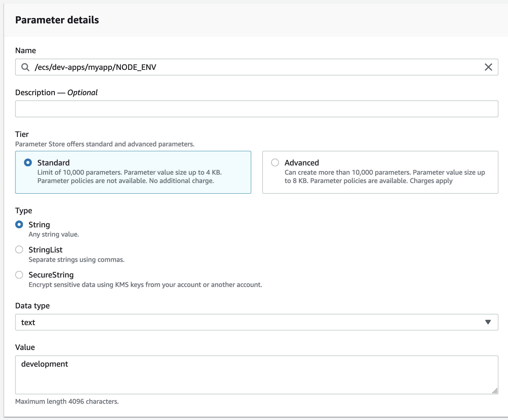

# Secrets

Following the 12-factor methodology, application configuration should be stored in the environment and injected dynamically when it runs, to avoid having configuration in the codebase.

This allows applications to be portable between different environments by selecting the configuration when it's deployed.

This configuration includes secrets and non-secrets (plaintext) values.

## SSM Parameter Store

SSM Parameters are supported natively by ECS and in EKS with a controller (more below).

In ECS, the application environment can be populated directly from SSM, declared in the task-definition as the example below:

```json
"secrets": [
  {
      "name": "NODE_ENV",
      "valueFrom": "arn:aws:ssm:ap-southeast-2:${AWS_ACCOUNT_ID}:parameter/app/${CLUSTER_NAME}/NODE_ENV"
  }
]
```

You could also use values directly in the task-definition, like the example:

```json
"environment": [
  {
    "name": "NODE_ENV",
    "value": "development"
  }
]
```

But by declaring it directly, the ability to change the value per environment is lost, so always prefer the previous method (pulling from SSM) unless you are sure that the variable won't change per environment.

### Creating new SSM Parameters

In the AWS Console, go to SSM (Systems Manager) and click at Parameter Store in the left-side menu.

Click Create Parameter and enter the details.



For the Name, follow the standard for the service you are using, for ECS is `/ecs/<cluser_name>/<app_name>/<VARIABLE_NAME>`.

Type can be "String" or "SecureString". Use String for plaintext variables and SecureString for secrets that are encrypted with KMS.

### When to use plaintext vs KMS-encrypted secrets?

Example of variables that can be set as plaintext:

* Usernames
* IDs (when not linked to customer data or considered a secret)
* Public Keys
* Application environment (such as `NODE_ENV` or `RUBY_ENV`)
* Flags (feature flags)
* Verbosity control

For other values, you should use the KMS-encrypted SecureString type, examples:

* Passwords
* Private Keys
* Values containing reference to a customer


## AWS Secrets Manager

Secrets Manager has a few differences from SSM. Notable ones are:

* Allows that values are rotated automatically using lambda functions
* Can store variables in JSON format with multiple values in one secrets
* Versioning of secrets
* It's not free like SSM Parameters

ECS has native support for Secrets Manager, example:

```json
"secrets": [
  {
    "name": "POSTGRES_HOST",
    "valueFrom": "arn:aws:secretsmanager:ap-southeast-2:${AWS_ACCOUNT_ID}:secret:/app/${SECRET_NAME}:NODE_ENV::"
  }
]
```

And fetching a specific version of the secret is also supported. More details at [https://docs.aws.amazon.com/AmazonECS/latest/developerguide/specifying-sensitive-data-secrets.html]().


## Secrets and EKS (Kubernetes)

Secrets from Secrets Manager and SSM Parameter Store can be synchronized with the cluster using a controller called External Secrets.

More details of this controller can be found at [https://github.com/external-secrets/kubernetes-external-secrets]()

This foundation deployed a version packed into a Terraform module from [https://github.com/DNXLabs/terraform-aws-eks-external-secrets]() - The readme includes an explanation of how the controller works and examples on how to use it.
