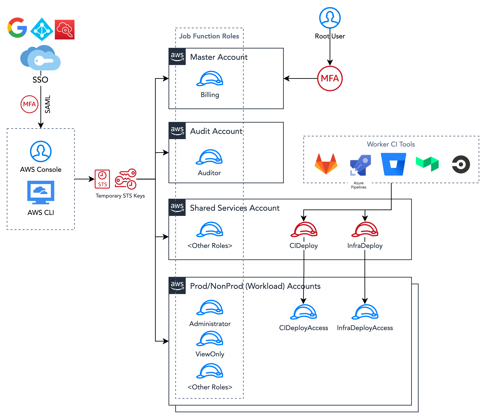

# Security

Citadel Well-architected Foundation applies a set of IAM (Identity and Access Management) roles across the AWS accounts to apply the concept of least privilege and provide exactly the needed policy at the time for users and systems. The concepts of least privilege implemented comply with CPS 234 in the Roles and Responsibilities session.

All configurations were applied using infrastructure-as-code using Terraform in the identity stack in this repo.

In this platform, most of the regular access to AWS cloud will be using SSO (Single Sign On) using the organisation's GSuite, Azure AD or AWS SSO.

Citadel Well-architected Foundation comes with 9 roles already available per environment, they are:

| IAM Role | Description | ARN |
| -------- | ----------- | --- |
| AdministratorAccess   | Grants all actions for all AWS services and for all resources in the account.                                                            | `arn:aws:iam::<aws_account_id>:role/AdministratorAccess` |
| ViewOnlyAccess        | Grants permissions to list AWS resources and basic metadata in the account across all services.                                          | `arn:aws:iam::<aws_account_id>:role/ViewOnlyAccess` |
| PowerUserAccess       | Grants permissions to performs application development tasks and can create and configure resources and services that support AWS aware application development. | `arn:aws:iam::<aws_account_id>:role/PowerUserAccess` |
| SecurityAudit         | Grants permissions to monitor accounts for compliance with security requeriments.                                                        | `arn:aws:iam::<aws_account_id>:role/SecurityAudit` |
| DataScientist         | Grants permissions to create, manage, run queries and perform data analytics.                                                            | `arn:aws:iam::<aws_account_id>:role/DataScientist` |
| DatabaseAdministrator | Grants permissions to create, configure, and maintain databases..                                                                        | `arn:aws:iam::<aws_account_id>:role/DatabaseAdministrator` |
| NetworkAdministrator  | Grants permissions to create and maintain network resources.                                                                             | `arn:aws:iam::<aws_account_id>:role/NetworkAdministrator` |
| SupportUser           | Grants permissions to contact AWS Support, creates support cases, and views the status of existing cases.                                | `arn:aws:iam::<aws_account_id>:role/SupportUser` |
| SystemAdministrator   | Grants permissions to create and maintain resources across a large variety of AWS services, including AWS CloudTrail, Amazon CloudWatch. | `arn:aws:iam::<aws_account_id>:role/SystemAdministrator` |

These roles are based on the policies maintained by AWS described in this page: [https://docs.aws.amazon.com/IAM/latest/UserGuide/access_policies_job-functions.html]()
