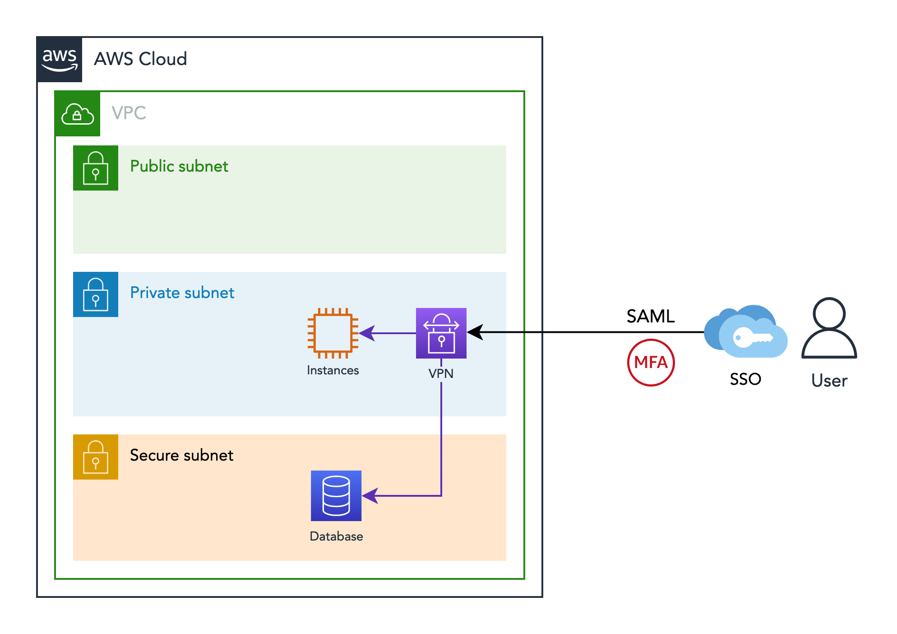

# VPN 

The foundation supports 2 types of VPN: OpenVPN and AWS Client VPN.

## OpenVPN

Deployed as an ECS Service in a cluster of 1 EC2 machine, this VPN is very cost-effective but has a few limitations:

- No support for SSO
- No redundancy
- Manual setup of users and certificates

The authentication is done via pre-created certificates with a one-time (temporary) password generated by a 2-factor app like Google Authenticator. So it is multifactor since it needs a certificate + one-time password to authenticate.

We recommend use of this VPN for cost-sensitive environments without need for compliance and SSO.

The VPN (Virtual Private Network) solution is open-source (OpenVPN) you can find more details consulting also their documentation: [https://openvpn.net/community-resources/]().

For instructions on how to manage and setup users, please see [https://docs.dnx.one/docs/foundation/5-configure-openvpn.html]().

The Terraform module that deploys the OpenVPN can be found here: [https://github.com/DNXLabs/terraform-aws-openvpn](), and the Docker container at [https://github.com/DNXLabs/docker-openvpn]().

## AWS Client VPN

Client VPN is a managed service by AWS. It supports SSO (using SAML) and has its own desktop client making it self-service for the SSO users.

It also supports authorisation rules, enabling access control to environments based on your SSO groups.

Furthermore, it's the recommended VPN for most use cases, due to its security, compliance and low-maintainance.

The cost can be seen in this page: [https://aws.amazon.com/vpn/pricing/]().

Normally it's deployed with one "endpoint association" to reduce costs, but in case of an AZ failure, the VPN can be offline for users. If uptime is not an issue, the endpoint can be re-associated to another working AZ as a manual process, enabling users back to use the VPN. Otherwise, the VPN can be associated with all AZs, increasing the uptime considerably but also the cost.

The Terraform module that deploys AWS Client VPN can be found at [https://github.com/DNXLabs/terraform-aws-client-vpn]().
