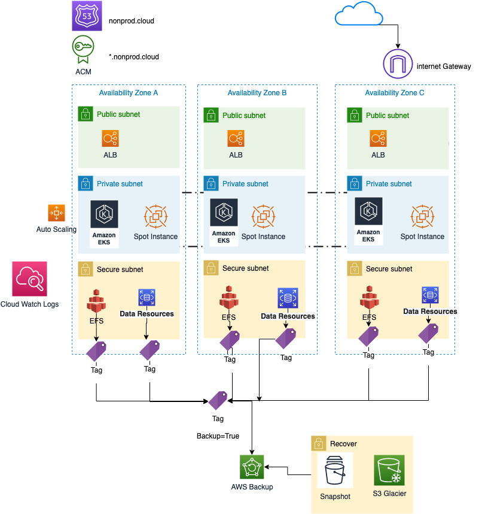

# Backup

The platform terraform stack is responsible for deploying all the resources that are required to run your workloads.

This stack requires the following stacks:

* Baseline
* Identity

This stack applies to AWS accounts of the **workload** and **backup** types.

## Terraform Workspaces

One terraform workspace per AWS Account, Region and Environment should be defined for this stack.

The workspace name is the client name, account name, plus region, plus environment.

Example, if you have a workload account called "nonprod" in 2 regions (us-east-1 and ap-southeast-2), and 2 environments (dev and staging), the workspaces for this AWS account alone would be:

* client-name-nonprod-ap-southeast-2-dev
* client-name-nonprod-ap-southeast-2-staging
* client-name-nonprod-us-east-1-dev
* client-name-nonprod-us-east-1-staging

## Features

### Backups

Enables AWS Backups that automatically backs up resources tagged properly.

### Cross-account backups

Opt-in for automatic cross-account backup copies and On-demand cross-account backup restore.

Use a cross-account backup if you want to securely copy your backups to one or more AWS accounts in your organization for operational or security reasons. If your original backup is inadvertently deleted, you can copy the backup from its destination account to its source account, and then start the restore.

You may choose to have a single centralized backup vault in your Backup Center Account or even to have vaults per workspaces, environments, etc. 

